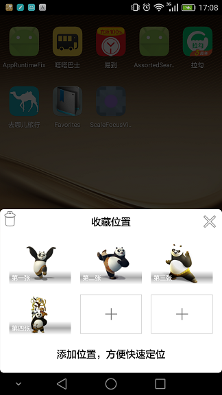
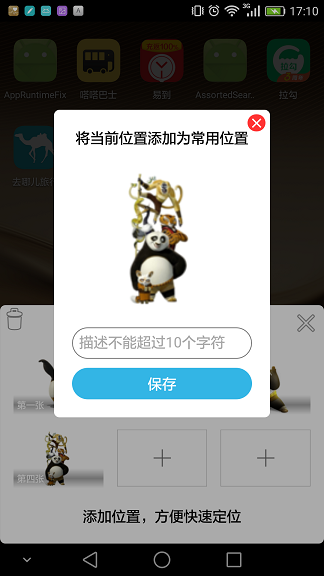

### 效果：

#### 竖屏：

#### 横屏：

### 使用说明

### Gradle:
Step 1. Add the JitPack repository to your build file
Add it in your root build.gradle at the end of repositories:

	allprojects {
		repositories {
			...
			maven { url "https://jitpack.io" }
		}
	}
Step 2. Add the dependency

	dependencies {
	        compile 'com.github.liujingsong:Favorites:-SNAPSHOT'
	}

#### 添加schemas:

    xmlns:app="http://schemas.android.com/apk/res-auto"

#### 引用控件：

    <com.bd.favorite.FavoritePicker
      app:mode="fill"
      android:layout_alignParentBottom="true"
      android:id="@+id/picker"
      android:layout_width="match_parent"
      android:layout_height="wrap_content"
      />

#### 调用方式
参考demo app：

    FavoritePicker picker= (FavoritePicker) findViewById(R.id.picker);
    /*设置栅格总数*/    
    picker.setLimitFavo(5);
    /*设置栅格间距*/
    picker.setSpace(5);
    /*设置栅格列数*/
    picker.setColumnNumber(3);

    /*设置操作监听*/
    picker.setOperatorListener(mOperatorListener);

    List<Favo> favos = new ArrayList<>();
    favos.add(new Favo(0,"第一张","http://download.easyicon.net/png/1082117/128/"));
    favos.add(new Favo(0,"第二张","http://download.easyicon.net/png/1082114/128/"));
    favos.add(new Favo(0,"第三张","http://download.easyicon.net/png/1082113/128/"));
    favos.add(new Favo(0,"第四张","http://download.easyicon.net/png/1082115/128/"));
    picker.bind(favos);

		private OperatorListener mOperatorListener = new OperatorListener() {
		@Override
		public void onCancel() {

		}

		@Override
		public void onDone() {

		}

		@Override
		public String onPick() {
			//TODO 这里返回 新建收藏 imageUrl

			return "http://download.easyicon.net/png/1082115/128/";
		}

		@Override
		public void onSelect(Favo favo) {

		}

		@Override
		public void onIntoDelete() {

		}

		@Override
		public void onFavoMakerCancel() {

		}

		@Override
		public void onFavoMakerSave(List<Favo> favos) {

		}

		@Override
		public void onFavoDelete() {

		}
};
